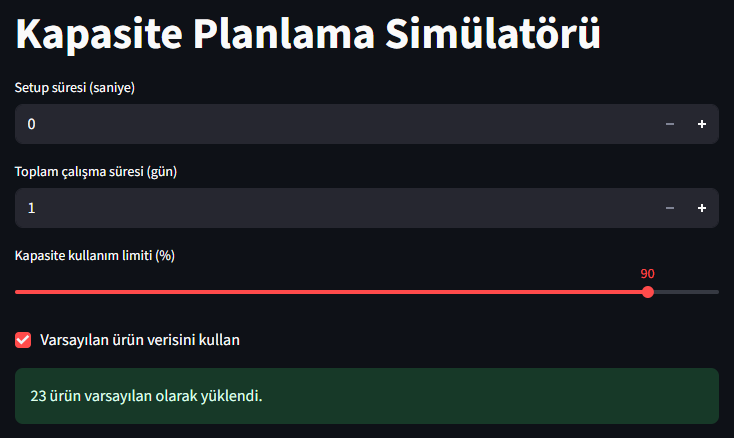

# Kapasite Planlama Simülatörü

## Proje 

Bir fabrikada farklı ürünler üretiliyor. Her ürünün üretim süresi ve yıllık sipariş miktarı var. Üretim için makineler var, ama makinelerin çalışma süresi ve kullanım yüzdesi sınırlandırılmış.

Hedef, ürünlerin üretim sürelerini bloklara bölmek ve bu blokları makinelerde verimli şekilde yerleştirerek:
- Gerekli en az makine sayısını belirlemek,
- Her makinenin ne kadar dolu olduğunu raporlamak.

### Problem Türü

Bu, **Bin Packing (Kutu Yerleştirme)** problemi denilen klasik bir problemdir. 
- “Ürün blokları” kutulara,
- “Makineler” ise kutuların yerleştirildiği kutulara karşılık gelir.

### Genel Kod Çalışma Diyagramı 


## **Adım 1: Parametre Girişini ve Temel Veri Yapısı**

- Setup süresi (w) [saniye]
- Toplam çalışma süresi  gün olarak (C_days) [gün] → C_total = C_days × 24 × 3600
- Kapasite kullanım limiti (usage_pct) [%] → L_limit = C_total × usage_pct/100
- Ürün sayısı (num_parts)
- Ürün i için çevrim süresi (t_i) [saniye]
- Ürün i için yıllık sipariş adedi (q_i)

**"input_data.py" Modülü:**

Bu modül, simülasyon için ürün verilerini sağlar.
- Varsayılan veri: Hızlı test ve demo amaçlı önceden tanımlanmış ürünler.
- Manuel giriş: Kullanıcı ürün sayısını belirleyip her ürün için çevrim süresi ve yıllık sipariş adedini girebilir.


## **Adım 2: Üretim Bloklarını Oluşturma**

Bu adımda ürünler, makine kapasitesine uygun bloklara dönüştürülür:

* Her ürünün **çevrim süresi** ve **yıllık sipariş adedi**, **makine başına kapasite limiti** göz önünde bulundurularak bloklara ayrılır.
* Eğer bir ürünün toplam süresi tek blokta kapasiteyi aşarsa, bloklar parçalara bölünür; böylece her blok, makine başına izin verilen süreyi aşmaz.

### Blok Süresi Hesaplama

Her blok için toplam süre şöyle hesaplanır:

```
block_time = qty × (t_i + w)
```

* `qty` : Bloğa atanacak ürün adedi
* `t_i` : Ürünün çevrim süresi
* `w` : Setup süresi

### "create_blocks.py" Modülü

Bu modülün amacı, ürünlerin üretim sürelerini ve yıllık adetlerini dikkate alarak **makine kapasitesine sığacak bloklar** oluşturmaktır.

* Eğer bir blok kapasiteyi aşarsa, blok parçalara bölünür.
* Böylece her blok makine başına izin verilen süreyi aşmadan üretim planına dahil edilir.

**Girdiler:**

* `setup_time` : Her ürün için eklenen setup süresi (saniye)
* `work_days` : Toplam çalışma süresi (gün)
* `usage_pct` : Makine başına kullanılabilir kapasite yüzdesi (%)
* `products` : Ürün listesi (her ürün bir sözlük: {'t_i': çevrim süresi, 'q_i': yıllık adet})

**Çıktılar:**

* `blocks` : Her blok için sözlük listesi, örn.

  ```python
  {'product_id': 1, 'qty': 500, 'block_time': 36000}
  ```

  * `product_id` : Ürünün benzersiz kimliği
  * `qty` : Bloktaki ürün adedi
  * `block_time` : Bloğun toplam üretim süresi (saniye)

* `capacity_limit` : Makine başına izin verilen maksimum çalışma süresi (saniye)
* `total_work_sec` : Toplam çalışma süresi (saniye)

**Not:** Bu fonksiyon, üretim bloklarını oluştururken her bloğun yalnızca tek bir ürün tipini içerdiğini varsayar.

**Modül Çalışma Mantığı**

1) Toplam çalışma süresini hesaplar 
2) Makine başına izin verilen kapasiteyi hesaplar
3) Ürünleri tek tek işler (Her ürün için toplam süresini bulur)
4) Tek blok mu, parçalı mı? 
- Eğer total_time ≤ capacity_limit → Ürün tek blok olarak eklenir.
- Yoksa → Kapasiteyi aşmayacak parçalara bölünür.
5) Bloklara bölme işlemi

-> Diyelim ki ürünün yıllık adedi 10.000 ve bir makinenin kapasitesi bir blokta 8.000 adede izin veriyor.
  - Fonksiyon önce ilk bloğa 8.000 adet ekler.
  - Kalan 2.000 adet için yeni bir blok oluşturur.
       Bu şekilde, hiçbir blok makinenin izin verilen kapasitesini aşmaz.

## **Adım 3: Blokların Makinelerde Atanması** 

**Algoritmalar (algorithms.py) Modülü** 

Bu modül, Üretim bloklarını makineler arasında yerleştirerek minimum makine sayısını bulmayı amaçlar. Bunun için üç farklı algoritma yaklaşımı içerir:
- First Fit Decreasing (FFD)
- Best Fit (BF)
- ILP/MIP Kesin Çözüm (pulp)

Her algoritma, `blocks` ve `capacity_limit` parametrelerini alır ve her makine için atanan bloklar ile toplam doluluk süresini içeren bir liste (`machines`) döner.

**Girdiler:**
- `blocks`: Her bloğun toplam süresini içeren liste
- `capacity_limit`: Makine başına izin verilen maksimum süre

**Çıktılar:**
- `machines`: her makine için atanan blokları ve toplam kullanım süresini içeren liste
  - `used_time`: Bu makinedeki tüm blokların toplam çalışma süresi. Yani makinenin toplam doluluk süresi.
  - `blocks` : O makineye atanmış tüm blokların listesi.


### **First Fit Decreasing (FFD) Algoritması**


**Amaç:**

Üretim bloklarını makinelerde yerleştirerek, minimum sayıda makine kullanmayı hedefler.

**Algoritma Mantığı:**
1) Bloklar sürelerine göre büyükten küçüğe sıralanır (decreasing).
2) Her blok, mevcut makinelerin ilk uygununa yerleştirilir (first fit).
3) Eğer uygun makine yoksa, yeni bir makine açılır.
4) Bu yöntem, minimum makine sayısına yaklaşmayı sağlar ve hızlı bir sezgisel çözüm sunar.

**Kullanım Sebebi:**
- Karmaşık problemlerde hızlı ve yeterince etkili yaklaşık çözüm sağlar.
- Küçük ve orta boy veri setleri için idealdir.

**⏱ Zaman Karmaşıklığı (Big-O):**
Bloklar büyükten küçüğe sıralanır **(O(N log N))** ve makinelerde yerleştirilir **(O(N×M))**. Makine sayısı blok sayısına yakınsa, toplam karmaşıklık **O(N²)** olarak alınabilir.

### **Best Fit (BF) Algoritması**

**Amaç:**

Üretim bloklarını makinelerde yerleştirerek, mümkün olan en az boş alan ile makine kullanımını optimize etmek ve minimum makine sayısına yaklaşmak.

**Algoritma Mantığı:**
1) Bloklar sürelerine göre büyükten küçüğe sıralanır.
2) Her blok, mevcut makineler arasında en az boş kalan kapasiteye sahip makineye yerleştirilir.
3) Eğer uygun makine yoksa yeni makine açılır.
4) Bu yöntem, blokları makineler arasında dengeli dağıtarak makine kullanımını optimize eder.

**Kullanım Sebebi:**
- Blokların makineler arasında dengeli dağılmasını sağlar.
- Küçük veya orta boy veri setlerinde hızlı ve etkili çalışır.

**⏱ Zaman Karmaşıklığı (Big-O):**
Bloklar sıralanır **(O(N log N))** ve makinelerde yerleştirilir **(O(N×M))**. Makine sayısı blok sayısına yakınsa, toplam karmaşıklık **O(N²)**’dir.


### **ILP/MIP Kesin Çözüm Algoritması (pulp)**

**Amaç:**

Üretim bloklarını makinelerde en az makine kullanacak şekilde yerleştirmek. Kapasite sınırları korunur ve optimum veya optimuma yakın çözüm elde edilir. 
- Tüm olası kombinasyonları kontrol ederek en iyi (optimal) çözümü bulur.
- Küçük veri setlerinde mükemmel sonuç verir, büyük veri setlerinde hesaplama süresi çok uzar veya time-out olabilir.

**Algoritma Mantığı:**
1) Her blok sadece bir makineye atanabilir.
2) Makine kapasite sınırını aşamaz.
3) Amaç fonksiyonu: kullanılan toplam makine sayısını minimize etmek.
4) Integer Linear Programming (ILP) veya Mixed Integer Programming (MIP) formülasyonu kullanılır ve çözücü (PULP) ile problem çözülür.

**Kullanım Sebebi:**
- Kesin çözüme veya optimuma yakın sonuca ulaşmak için tercih edilir.
- Küçük ve orta boy veri setlerinde doğru sonuç verir.
- Yaklaşık heuristik (FFD, BF) yöntemler yeterli değilse kullanılır.

**⏱ Zaman Karmaşıklığı (Big-O):**
NP-Hard problem olduğundan veri büyüdükçe çözüm süresi üssel artar. Değişken ve kısıt sayısı **O(N²)**, ILP’nin en kötü durumu **O(2^(N²))**, sonuç işleme **O(N²)** (ihmal edilebilir).


**"ilp_bin_packing" Modülü Hata Yönetimi:**

- Eğer CBC çözücüsü belirlenen zaman sınırı içinde problemi çözemez veya geçerli bir çözüm bulamazsa, fonksiyon kullanıcıya uyarı mesajı verir ve boş bir liste döndürür.

## **Adım 5: Streamlit Üzerinde Raporlama**

### **"reporting.py" Modülü**
Bu modül, üretim planlama ve blok atama sürecinde makine ve blok bilgilerini detaylı şekilde raporlayarak kullanıcıya sunmak için kullanılır. Her makineye atanmış blokların çalışma süreleri, toplam süreler ve blok başına hesaplanan zaman bilgilerini düzenli formatta sunar.

**Fonksiyonlar ve Açıklamaları**

- **create_machine_summary(machines, total_work_sec)**
    - Her makinenin toplam kullanım süresi, kapasite yüzdesi ve yaklaşık çalışma gününü hesaplar.
    - Özet tabloyu pandas DataFrame olarak döndürür.
    - Örneğin, Makine 1’in %75 kapasite kullandığını ve yaklaşık 180 gün çalıştığını gösterir.

- **create_machine_summary_avg(machines, total_work_sec)**
    - `create_machine_summary` fonksiyonunu kullanarak makine özetini alır ve ortalama değerleri hesaplar.
    - Döndürülen tablo, makine sayısı ve tüm makineler için ortalama kullanılan süre, ortalama kapasite kullanımı ve ortalama çalışma gününü içerir.
    - Örneğin, tüm makinelerin ortalama %70 kapasite kullandığını ve yaklaşık 150 gün çalıştığını gösterir.

- **create_machine_detail(machines)**
    - Her makinedeki blokları detaylandırır: hangi ürün, kaç adet ve blok süresi.
    - Her blok bir satır olarak tabloya eklenir ve pandas DataFrame döner.
    - Kullanıcı blok bazlı üretim dağılımını görselleştirebilir veya filtreleyebilir.

- **plot_machine_usage(machines, total_work_sec)**
    - Makine başına kapasite kullanımını görselleştirir (bar grafiği).
    - Kullanıcı, makinelerin doluluk oranlarını hızlıca görselleştirebilir.

- **plot_product_distribution(machines)**
    - Makine başına ürün dağılımını stacked bar chart ile gösterir.
    - Her ürün farklı renk ile gösterilir, makineler arası dağılım kolayca anlaşılır.

- **plot_block_details(machines)**
    - Her blok için adet ve süreyi aynı grafikte gösterir (bar + line grafiği).
    - Kullanıcı, blok boyutları ve süreler arasındaki ilişkiyi görselleştirebilir.

## **Adım 6: Kapasite Planlama Simülatörü Streamlit Arayüzü**

Bu arayüz, üretim bloklarını makinelerde planlamak ve simüle etmek için geliştirilmiş bir görsel araçtır. Kullanıcılar ürün verilerini girerek veya varsayılan veri setini seçerek, farklı yerleştirme algoritmalarını deneyebilir ve sonuçları tablolar ve grafiklerle görebilir.

### Özellikler

* **Ürün Verisi Girişi:** Kullanıcı manuel olarak ürün bilgilerini girebilir veya varsayılan ürün setini kullanabilir.
* **Yerleştirme Algoritmaları:** Farklı algoritmalarla blokların makinelerde dağılımını simüle edebilir:
  * First Fit Decreasing (FFD)
  * Best Fit (BF)
  * ILP/MIP Kesin Çözüm (pulp)
* **Raporlama:**
  * Makine bazlı özet tablo (toplam süre, kapasite kullanımı, yaklaşık çalışma günü)
  * Makine bazlı detay tablo (her blok ve içerikleri: ürün, adet, süre)
* **Görselleştirme:**
  * Makine bazlı kapasite kullanımı bar grafiği
  * Makine başına ürün dağılımı stacked bar grafiği
  * Blok bazlı üretim detayları (blok süresi ve adet bilgisi)

## **Adım 7: Kullanım**

**Local Çalıştırma:**

1. Gerekli kütüphaneler yüklenir.
2. Terminalde uygulama başlatılır:

   ```bash
   streamlit run app.py
   ```
3. Parametreler girilir (setup süresi, çalışma süresi, kapasite limiti).
4. Algoritma seçilip ürün verileri girilir.
5. "Simülasyonu Çalıştır" butonuna tıklanarak, tabloları ve grafikleri incelenebilir, CSV olarak indirilebilir.

**Docker ile Çalıştırma:**

```bash
docker-compose build
docker-compose up
```

Ardından tarayıcıdan `http://localhost:8501` adresine gidilir.


## **Adım 8: Doğrulama Testleri ve Çıktıları:**

### Test-1

Arayüzde manuel olarak test girdi verileri girilir.


- Setup süresi (w) : 0 
- Toplam çalıişma süresi (gün): 1
- Kapasite kullanım limiti (%): 50
- Ürün sayısı: 2

- Ürün 1: 
  - Çevrim süresi (saniye): 1000
  - Yıllık sipariş adedi: 10
- Ürün 2: 
  - Çevrim süresi (saniye): 2000
  - Yıllık sipariş adedi: 10


**Sonuçlar:** 

| Algoritma Adı | Makine Sayısı | Kullanılan Süre (sn) | Kapasite Kullanımı (%) | Yaklaşık Çalışma Süresi (gün) | Algoritma Çalışma Süresi (sn) | Kod Çalışma Süresi (sn) | Bellek Kullanımı (MB) |
| ------------- | ------------- | -------------------- | ---------------------- | ----------------------------- | ----------------------------- | ----------------------- | --------------------- |
| First Fit Decreasing (FFD) | 1             | 30000                | 34.72                   | 0.35                          | 0.000027                      | 1.07                    | 168.35                  |
| Best Fit (BF)   | 1             | 30000                | 34.72                   | 0.35                          | 0.000015                      | 1.16                    | 168.00                  |
| ILP/MIP Kesin Çözüm (pulp) | 1             | 30000                | 34.72                   | 0.35                          | 0.222419                      | 1.30                    | 167.93                  |

**Yorum:** 
- FFD, BF, ILP hepsi çalışıyor.
- ILP burada kesin çözüm veriyor, ama çalışma süresi FFD/BF’den daha uzun.
- FFD & BF milisaniyeler içinde çözüyor.
- ILP küçük veri setlerinde optimal çözümü garanti ettiği için tercih edilebilir ama hız önemliyse FFD/BF yeterli.

**FFD için Makine Bazlı Kapasite Kullanım Grafiği:**


- Bu grafik, makine bazlı kapasite kullanımını görmeyi sağlıyor. 

**FFD için Makine Başına Ürün Dağılımı Grafiği:**


- Bu grafik, makine başına düşen ürün adedi dağılımı görmeyi sağlıyor. 
- Bütün ürünler tek bir makine içinde. 

**FFD için Blok Bazlı Üretim Detayları Grafiği:**


- Bu grafik, blokların hem adet hem de süre bazında nasıl dağıldığını hızlıca görmeyi sağlıyor.
- İlk blok daha uzun sürelidir, ikinci blok daha kısa.
- Adetler her iki blokta eşit, ancak çevrim süreleri farklılığı nedeniyle toplam süre farklı.


### Test-2

Kod içerisinde seçilen 3 ürün verileri ile girdi verileri otomatik olarak doldurulur.

Örnek: 
[{'t_i': 67, 'q_i': 260000},
  {'t_i': 20, 'q_i': 130000},
  {'t_i': 58, 'q_i': 130000}]


**Sonuçlar:**  

Ortalama Genel Özete bakılıyor

| Algoritma Adı | Makine Sayısı | Ortalama Kullanılan Süre (sn) | Ortalama Kapasite Kullanımı (%) | Ortalama Yaklaşık Çalışma Süresi (gün) | Algoritma Çalışma Süresi (sn) | Kod Çalışma Süresi (sn) | Bellek Kullanımı (MB) |
| ------------- | ------------- | -------------------- | ---------------------- | ----------------------------- | ----------------------------- | ----------------------- | --------------------- |
| First Fit Decreasing (FFD) | 355             | 77633,8               | 89,85                   | 0.9                         | 0.018087                      | 8.89                    | 327.46                  |
| Best Fit (BF)   | 355             | 77633,8                | 89,85                   | 0.9                          | 0.019658                      | 8.23                    | 327.31                  |
| ILP/MIP Kesin Çözüm (pulp) | Sonuç alınamadı


**Yorum:** 
- FFD ve BF benzer sonuçlar veriyor. FFD ve BF heuristik, hızlı ve pratik çözüm sağlıyor.
    - heuristik = “yaklaşık ama hızlı çözüm yöntemi”
- ILP çözüm veremiyor, verilen süre içerisinde çözüm alınamadığı için boş liste döndürülüyor. 

ILP/MIP Kesin Çözüm (pulp) için neden sonuç alınamadı:
- Verilen verilerde blok sayısı ve her blok süresi çok büyük.
- Çözüm: Daha küçük veri setiyle test etmek → örneğin q_i = 10–100 gibi. Veya toplam çalışma süresi arttırılabilir.

### Test-3


Bir önceki teste göre: 
- Toplam çalışma sayısı arttırıldı.
- Kapasite kullanım limiti azaltıldı.

| Algoritma Adı | Makine Sayısı | Ortalama Kullanılan Süre (sn) | Ortalama Kapasite Kullanımı (%) | Ortalama Yaklaşık Çalışma Süresi (gün) | Algoritma Çalışma Süresi (sn) | Kod Çalışma Süresi (sn) | Bellek Kullanımı (MB) |
| ------------- | ------------- | -------------------- | ---------------------- | ----------------------------- | ----------------------------- | ----------------------- | --------------------- |
| First Fit Decreasing (FFD) | 54             | 510370,37                | 59,07                   | 5,91                         | 0.000528                     | 1.95                    | 167.83                  |
| Best Fit (BF)   |54             | 510370,37                | 59,07                   | 5.91                          | 0.000301                      | 2.08                    | 167.72                  |
| ILP/MIP Kesin Çözüm (pulp) | 54             | 510370,37                | 59,07                   | 5,91                         | 1.312509                      | 3.34                    | 168.67

**Yorum:**
- FFD ve BF benzer sonuçlar veriyor; ortalama kullanılan süre ve kapasite kullanımında fark yok.
- Algoritma çalışma süreleri çok kısa ve birbirine yakın.
- Bellek kullanımı açısından BF, FFD’ye göre biraz daha tasarruflu.
- Kesin çözüm sunan ILP/MIP, aynı sonuçları veriyor ancak algoritma süresi ve kod çalışma süresi daha yüksek.

### Test-4

Kod içerisinde seçilen tüm ürünlerin (23 ürün) verileri ile girdi verileri otomatik olarak doldurulur.



**Sonuçlar:**  

Ortalama Genel Özete bakılıyor

| Algoritma Adı | Makine Sayısı | Ortalama Kullanılan Süre (sn) | Ortalama Kapasite Kullanımı (%) | Ortalama Yaklaşık Çalışma Süresi (gün) | Algoritma Çalışma Süresi (sn) | Kod Çalışma Süresi (sn) | Bellek Kullanımı (MB) |
| ------------- | ------------- | -------------------- | ---------------------- | ----------------------------- | ----------------------------- | ----------------------- | --------------------- |
| First Fit Decreasing (FFD) | 2622             | 77692,6                | 89.92                   | 0.9                         | 0.585996                     | 181.76                    | 1638.91                  |
| Best Fit (BF)   | 2622             | 77692,6                | 89.92                   | 0.9                          | 0.590346                      | 121.79                    | 899.79                  |


**Yorum:**  
- FFD ve BF ikisi de sonuç veriyor ama BF daha az bellek kullanıyor.
- Çalışma süreleri benzer (FFD ≈ BF).
- Bellek kısıtı önemliyse BF biraz daha avantajlı.


### **Bütün Testler için Genel Yorum:**

- **FFD ve BF benzer sonuçlar veriyor**: Ortalama kullanılan süre, kapasite kullanımı ve yaklaşık çalışma süresi çoğu testte neredeyse aynı.
- **Bellek kullanımı:** FFD ve BF arasındaki fark testlere göre değişiyor; büyük veri setlerinde BF biraz daha az RAM kullanıyor.
- **ILP/MIP:** Problem büyüdükçe çözüm süresi artar, bazen time-out olur.
- **Toplam çalışma süresi arttıkça:** Makine sayısı azalır, kapasite kullanımı daha rahat olur.
- **Kapasite limiti düşerse:** Makine başına yük azalır, makine sayısı artar.
- **Öneri:** Küçük veri setlerinde kesin çözüm (ILP/MIP), büyük veri setlerinde hızlı ve yeterli çözüm için FFD/BF tercih edilmeli.
